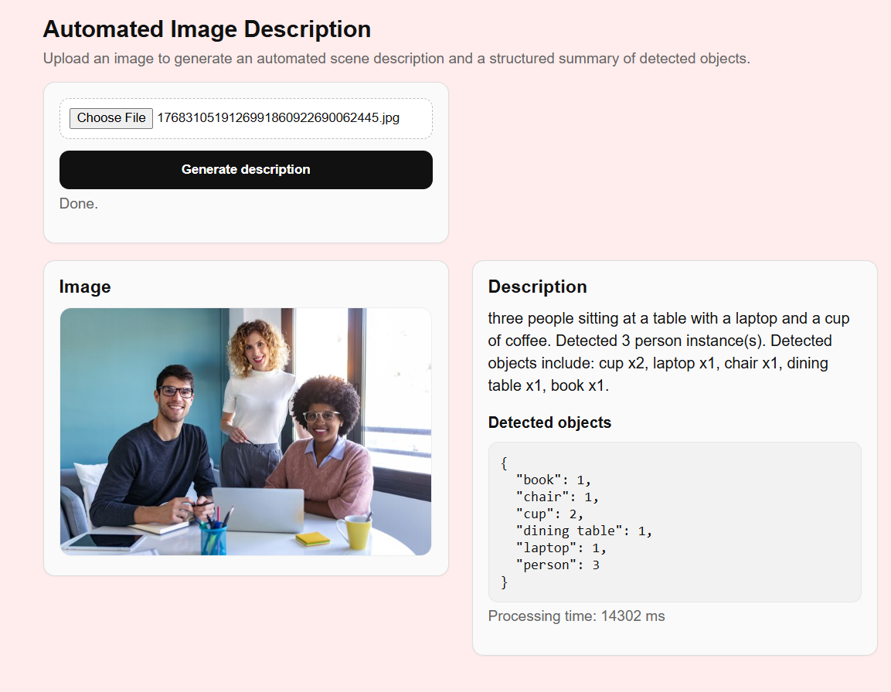

# Automated Image Description

An AI-powered web application that generates natural-language scene descriptions and structured object summaries from uploaded images.

The system integrates pretrained computer vision models for image captioning and object detection into an interactive Flask web interface, producing both human-readable descriptions and machine-readable outputs in real time.

---

## Overview

This application enables users to upload an image and automatically receive:

- a natural-language scene description  
- detected object categories and counts  
- structured JSON output  
- per-image inference time  

It demonstrates the end-to-end integration of multiple pretrained computer vision models within a lightweight web application.

---

## Demo

### Example Workflow
1. Upload an image  
2. Generate description  
3. View detected objects and scene summary  

<p align="center">
  
</p>

<p align="center">
  
</p>

<!-- Optional GIF
<p align="center">
  
</p>
-->

---

## Features

- Image upload and preview interface  
- Automatic scene description generation (image captioning)  
- Object detection with category counting  
- Structured JSON output for downstream processing  
- Real-time inference on uploaded images  
- Combined computer vision pipeline (captioning + detection)  
- Per-image processing time reporting  
- Lightweight interactive web UI  

---

## Tech Stack

**Backend**
- Python  
- Flask  

**AI / Computer Vision**
- Hugging Face Transformers  
- Pretrained Image Captioning Model  
- Pretrained Object Detection Model  

**Frontend**
- HTML  
- CSS  

---

## Models Used

This application uses pretrained transformer-based computer vision models for inference:

- **Image Captioning:** pretrained vision-language model (Hugging Face)  
- **Object Detection:** pretrained detection transformer model  

Both models are used in inference-only mode without additional fine-tuning.

---

## How It Works

1. The user uploads an image through the web interface  
2. The backend loads and preprocesses the image  
3. A pretrained image captioning model generates a natural-language description  
4. A pretrained object detection model identifies objects and counts instances  
5. Results are returned as:
   - natural-language description  
   - structured JSON object counts  
   - processing time  

---

## Project Structure

```
.
├─ app/
│  ├─ templates/
│  │  └─ index.html
│  ├─ static/
│  │  └─ style.css
│  └─ uploads/
├─ assets/
│  ├─ 01_upload.png
│  └─ 02_result.png
├─ app.py
└─ README.md
```

---

## Installation

```bash
git clone https://github.com/<your-username>/<repo-name>.git
cd <repo-name>
pip install -r requirements.txt
```

---

## Run Locally

```bash
python app.py
```

Open in browser:

http://127.0.0.1:5000

---

## Example Output

**Description**

three people sitting at a table with a laptop and a cup of coffee

**Detected Objects**

```json
{
  "person": 3,
  "laptop": 1,
  "cup": 2,
  "chair": 1,
  "dining table": 1,
  "book": 1
}
```

---

## Use Cases

- Assistive technology (automatic scene description)
- Image content analysis
- Computer vision demonstrations
- AI education projects
- Dataset annotation support

---

## Limitations

- Performance depends on pretrained model accuracy  
- Crowded or complex scenes may reduce detection quality  
- No domain-specific fine-tuning applied  
- Inference speed varies with hardware  

---

## Future Improvements

- Real-time webcam input
- Batch image processing
- Bounding box visualization
- Model selection options
- REST API endpoint

---

## License

MIT License
